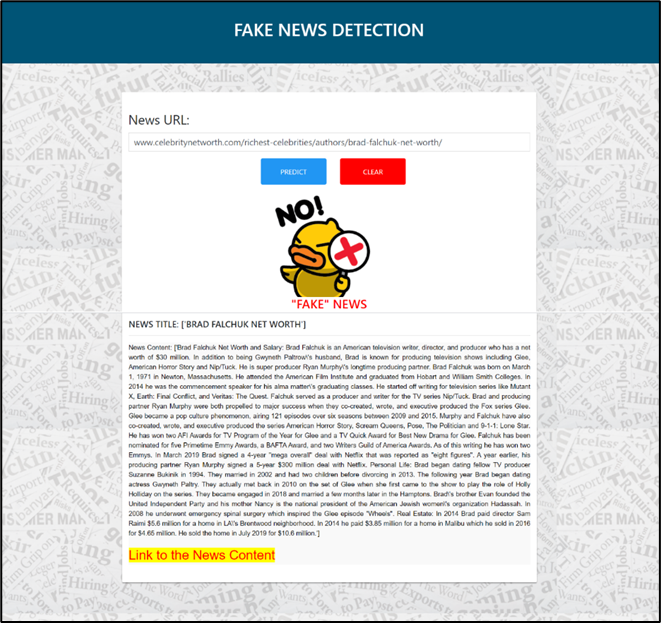
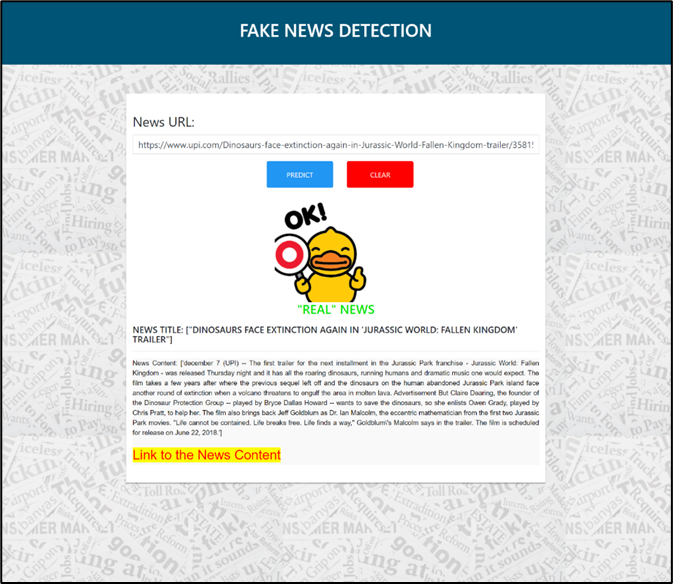

# Degree Final Year Project: FAKE NEWS DETECTION OF TWEETS USING DATA MINING APPROACH WITH ENHANCED FAKENEWSNET DATASET 

## Introduction
This repository contains the code and resources for my degree final year project, titled "FAKE NEWS DETECTION OF TWEETS USING DATA MINING APPROACH WITH ENHANCED FAKENEWSNET DATASET" The project aims to develop a machine learning model capable of analyzing sentiment in text data and perform prediction on the news whether is fake/real news using machine learning techniques.

## Project Overview
With the increasing use of social media, the spread of fake news has become a significant concern. This project addresses the challenge of fake news detection by enhancing Twitter data preprocessing techniques and leveraging state-of-the-art machine learning models.

## Features
- Implements data preprocessing techniques specific to Twitter data (extracted using Tweepy Python Packages), including noise removal, tokenization, and hashtag handling.
- Uses advanced machine learning algorithms such as **Decision Tree, Random Forest, Support Vector Machines (SVM), Naive Bayes, Logistics Regression**.
- Evaluates model performance using metrics like accuracy, precision, recall, and F1-score.
- Provides an intuitive user interface for real-time fake news classification. Below are the examples of screenshot from the system:

